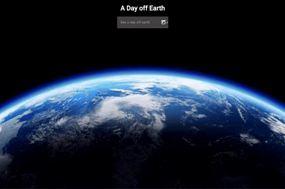

# A Day off Earth

Project Utilises: 

- Angular (+ Material)
- GCP (Cloud Functions, Secret Manager, Cloud Storage)
- Terraform
- Docker

Utilising NASAs Astronomy Picture of the day API to display an image based on a historic day input, by taking advantage of Google Cloud Functions we are able to store the API Key in Secret Manager. The build of the function and all relevant components was done using terraform and a zip of the function written in Node.

